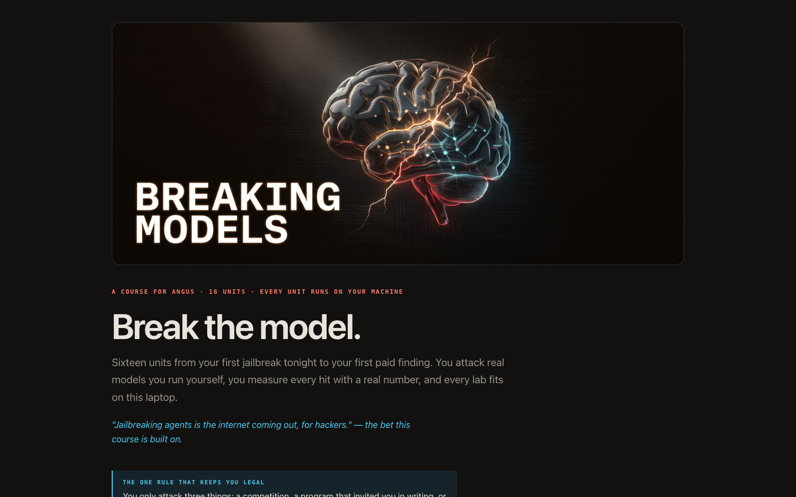
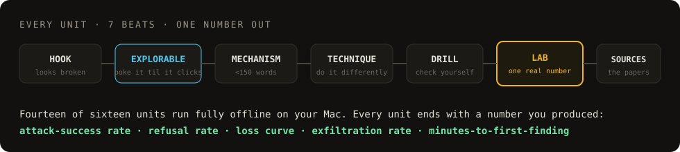

<div align="center">
  
</div>

<h1 align="center">Breaking Models — AI Red-Team Course</h1>

<p align="center"><i>"Another 'intro to AI security' course? Let us guess — it links a YouTube playlist and calls it a lab."</i></p>

<div align="center">


[](SCORECARD.md)


</div>

<br/>

<p align="center"><b>From your first jailbreak tonight to your first paid finding.</b><br/>
Twenty-seven labs you run on your own machine — brand-new to expert. Every unit ends with a number you produced yourself.</p>

<div align="center">
  
</div>

---

## ⚡ Start here

You need nothing installed for Unit 1. Just serve the course and open it:

```bash
git clone https://github.com/angusbuilds/redteam-course.git
cd redteam-course
./start.sh            # serves on :8901 and opens the course
./start.sh unit01     # jump straight to a unit
```

Unit 1's lab cracks a vault through the `claude` CLI — no API key, no setup. Units 2+ target
**local open-weight models you run yourself**; Unit 2 walks you through the one-time install:

```bash
ollama pull qwen2.5:7b-instruct-q4_K_M   # a capable 7B target
ollama pull llama3.2:1b                    # a cheap attacker/judge
uv python install 3.12 && uv venv          # the training toolchain (mlx-lm)
```

---

## 🧠 What is this?

The "learn AI security" space is full of playlists and slide decks. That's not what this is.

**This is twenty-seven labs.** You attack real models, on your own hardware, and you measure every hit
with a real number — an attack-success rate, a refusal rate, a loss curve, an exfiltration rate.
Nothing here is a vibe or a screenshot. By the end you have a portfolio of measured findings and
one real bug-bounty submission.

It runs the whole ladder: **jailbreaks → automated attacks → agent & prompt-injection → owning the
weights (fine-tune, abliterate, backdoor) → defenses → getting paid.**

> The bet it's built on: *"Jailbreaking agents is the internet coming out, for hackers."*
> Agent and injection attacks (Phase C) are the least-defended surface in 2026 — so they're weighted heavily.

---

## 🔥 Why this one

**You own the target.** APIs rate-limit and filter every probe. From Unit 2 on you attack local
models you run yourself — thousands of attempts, and the fine-tuning attacks that APIs can never let you try.

**A win on night one.** Unit 1 ends with a cracked vault, not a reading list. The misconfigured one
leaks, the two hardened ones hold — and that gap is the whole course.

**One number per unit.** Visible progress every sitting. Those numbers become your bounty evidence.

**Built for how you learn.** Short lines, numbers in columns, an interactive explorable in every
unit instead of a wall of text.

**Honest about the wall.** Almost every unit runs fully offline on your own machine; the few that
touch a hosted API or a rented GPU-hour say so before you reach them.

---

## 🏗️ How a unit works

<div align="center">
  
</div>

---

## 🪜 The ladder

**27 units · 7 phases · brand-new to expert, zero to first paid finding.**

### Phase 0 — Foundations
| # | Unit | You walk out with |
|---|------|-------------------|
| 00 | Start Here | the mental model, the law, and 10 attacks tagged by OWASP category |

### Phase A — Get in the game
| # | Unit | You walk out with |
|---|------|-------------------|
| 01 | First Win + Field Map | a cracked vault (1/3) + a venue scorecard |
| 02 | Local Toolchain | your own models running; 4/4 green checks |
| 03 | Manual Pattern Speedrun | your first attack-success rate + minutes-to-first-finding |

### Phase B — Measure like a pro
| # | Unit | You walk out with |
|---|------|-------------------|
| 04 | Benchmarks & Harness | an ASR% and a 3-way judge-disagreement% |
| 05 | Automated Attacks: PAIR + TAP | a model that jailbreaks another model + queries-to-success |
| 06 | Multi-Turn & Scaling | a Crescendo transcript + an ASR-vs-N curve |

### Phase C — Attack the agents *(your thesis)*
| # | Unit | You walk out with |
|---|------|-------------------|
| 07 | Indirect Prompt Injection | an ASR% for instructions hidden in data |
| 08 | Tool Hijacking & MCP | an unauthorized-tool-call rate + a poisoned MCP server |
| 09 | Multi-Agent, Memory, Browser | propagation depth + poisoned-doc resurface rate |
| 10 | Pro Auditing: Inspect + Petri | an Inspect eval report + automated-vs-manual agreement% |

### Phase D — Own the model
| # | Unit | You walk out with |
|---|------|-------------------|
| 11 | Post-Training: SFT / LoRA | your first fine-tune: tokens/sec + a loss curve |
| 12 | Refusal-Direction Ablation | refusal rate before vs after (X% → Y%) |
| 13 | Fine-Tune Attacks | a 4-row safety-delta / trigger-survival table |
| 14 | Preference-Opt + Gradient Attacks | a DPO result + a go-local-or-rent-GPU verdict |
| 15 | Defense Awareness | the effort-multiplier to beat circuit breakers |

### Phase E — Get paid
| # | Unit | You walk out with |
|---|------|-------------------|
| 16 | First Paid Submission | one scoped, written, submitted finding |

### Phase F — The Expert Track
| # | Unit | You walk out with |
|---|------|-------------------|
| 17 | RAG & Vector-Store Exploitation | poisoned-chunk top-k landing rate |
| 18 | Multimodal Jailbreaks | image/typographic jailbreak ASR |
| 19 | Data Extraction, Membership & Stealing | extraction rate · MIA AUC · clone agreement |
| 20 | Classical Adversarial ML | FGSM/PGD transfer ASR at fixed ε (via ART) |
| 21 | Mech-Interp Attack Surface | the exact layer+head behind a behavior |
| 22 | MCP Supply-Chain Audit | poisoned/rug-pull/typosquat servers flagged |
| 23 | Computer-Use Agent Range | web-OS injection ASR across pages |
| 24 | Output Handling, Unbounded Consumption & Supply Chain | cost-amplification × · SQL/XSS/SSRF sinks |
| 25 | Governance, Scoring & Disclosure | OWASP/ATLAS/NIST map + an AIVSS score |
| 26 | CTF Gauntlet + Careers | gauntlet levels solved + a cert/career map |

**Three capstones:** a submitted bounty report · a full injection chain against your own honeypot · a before/after refusal-rate delta from your own fine-tune.

---

## 🧰 The arsenal

The open-source tools and papers the labs put in your hands. (Full per-unit sourcing lives in each unit's **Sources** beat.)

<!-- ARSENAL-TABLE -->
| Tool | For | Unit |
|------|-----|------|
| [Ollama](https://ollama.com) · [mlx-lm](https://github.com/ml-explore/mlx-lm) | run & fine-tune local models | 2, 11–14 |
| [garak](https://github.com/NVIDIA/garak) · [promptfoo](https://www.promptfoo.dev) | vulnerability scanning & eval harness | 4 |
| [JailbreakBench](https://github.com/JailbreakBench/jailbreakbench) · [HarmBench](https://github.com/centerforaisafety/HarmBench) | the shared ASR yardstick | 4, 5 |
| [PyRIT](https://github.com/Azure/PyRIT) | automated attack framework (TAP built-in) | 5 |
| [AgentDojo](https://github.com/ethz-spylab/agentdojo) · [InjecAgent](https://github.com/uiuc-kang-lab/InjecAgent) | agent injection benchmarks | 7–9 |
| [Inspect](https://inspect.aisi.org.uk) · [Petri](https://www.anthropic.com/research/petri-open-source-auditing) | the auditing framework labs publish with | 10 |
| [circuit-breakers](https://github.com/GraySwanAI/circuit-breakers) · [nanoGCG](https://github.com/GraySwanAI/nanoGCG) | defenses & gradient attacks | 14, 15 |
| [L1B3RT4S](https://github.com/elder-plinius/L1B3RT4S) | a library of jailbreak shapes | 3 |
<!-- /ARSENAL-TABLE -->

**→ [The full Arsenal](ARSENAL.md)** — 40+ tools and benchmarks mapped to their units, with Mac-feasibility and star counts, plus the [MITRE ATLAS](https://github.com/mitre-atlas/atlas-data) spine every finding tags against.

---

## 📚 New here? The foundations

This course assumes you know roughly how an LLM works. If a term is new, these free resources are where the foundation lives:

| Topic | Where |
|-------|-------|
| How LLMs work (tokens, attention, pre/post-training) | Karpathy's *Intro to LLMs*, 3Blue1Brown |
| Prompt hacking fundamentals | [Learn Prompting — AI Red Teaming](https://learnprompting.org/docs/category/ai-red-teaming) |
| The risk taxonomy | [OWASP LLM Top 10](https://genai.owasp.org/llm-top-10/) — see [SCORECARD](SCORECARD.md) for our coverage |
| The tactics matrix | [MITRE ATLAS](https://atlas.mitre.org/) |

---

## ⚖️ The one rule

You only ever attack **one of three things**: a competition, a program that invited you in writing,
or a model you run on your own machine. Never a live product you weren't asked to test. Never publish
a working exploit before the vendor has fixed it. **No real-harm content, ever — you measure that a
bypass works, you never use what it produces.**

See [SECURITY.md](SECURITY.md) for the full ethics + disclosure policy.

---

## 🤝 Contributing

New units, better labs, fresh venue data — see [CONTRIBUTING.md](CONTRIBUTING.md) and the
[Code of Conduct](CODE_OF_CONDUCT.md). Changes land through the same gate the course was built with:
every page passes a headless render check (zero console errors) and every link resolves.

---

<p align="center"><sub>MIT licensed · authorized security research only · built with Claude + Codex, art by Higgsfield</sub></p>
